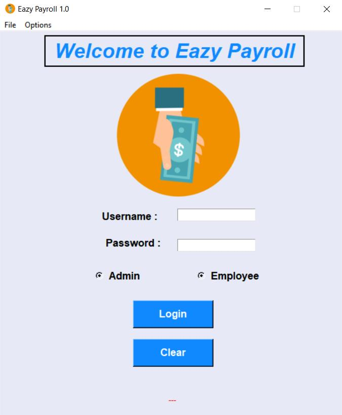
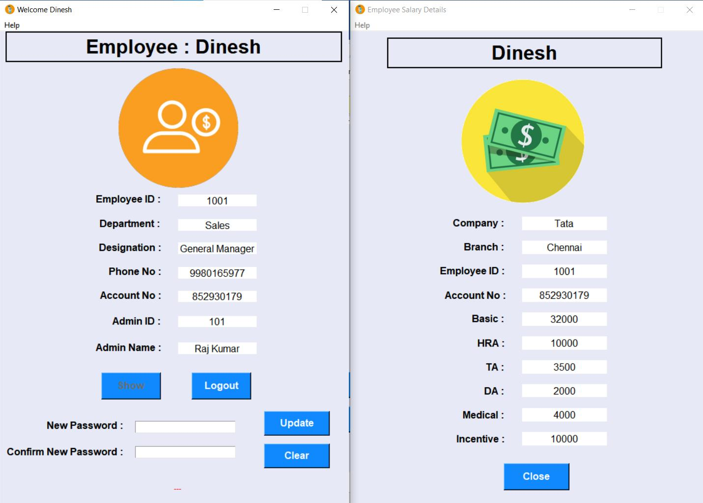
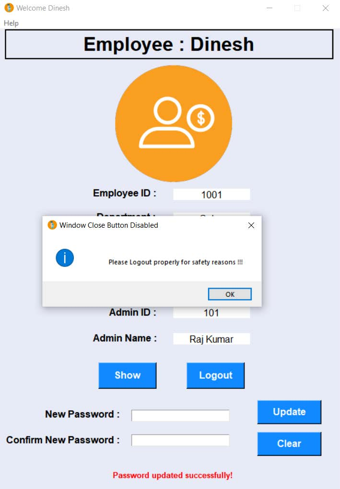
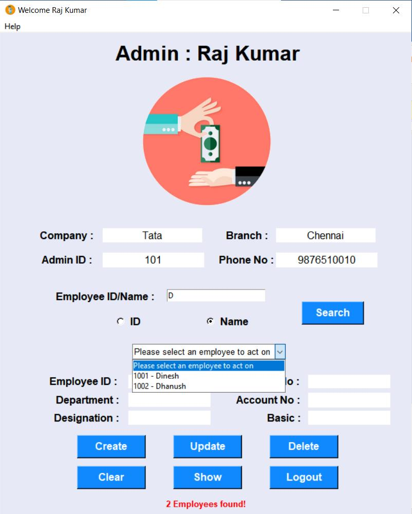
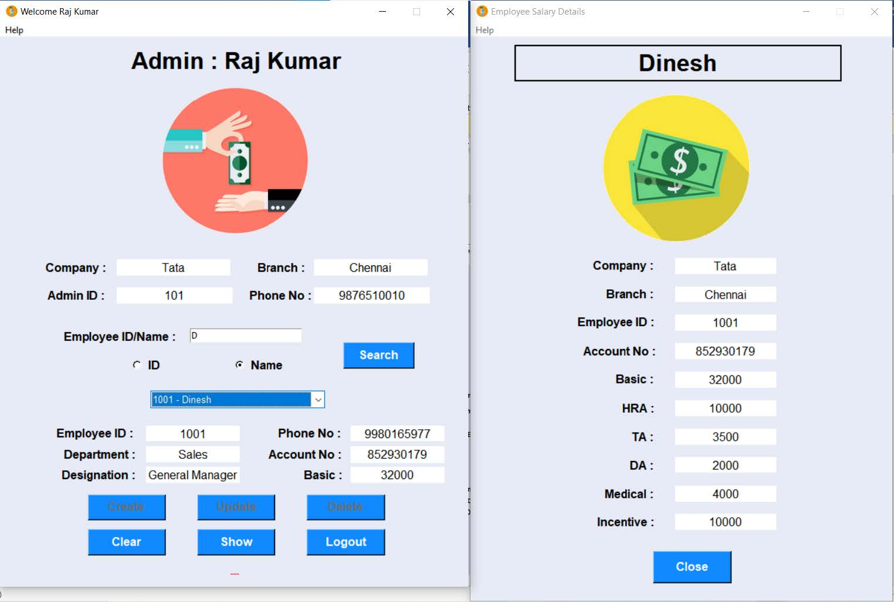
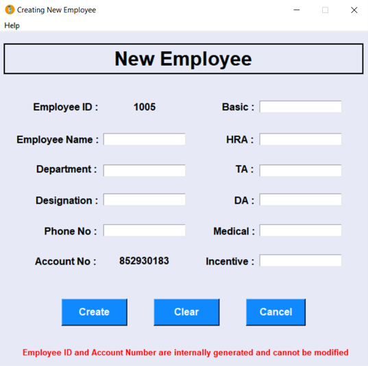
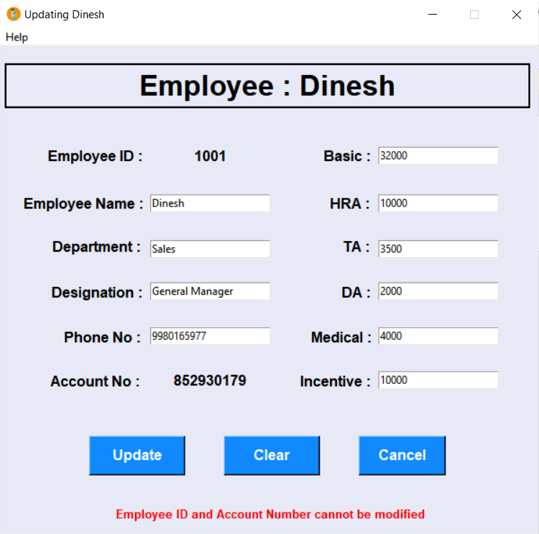
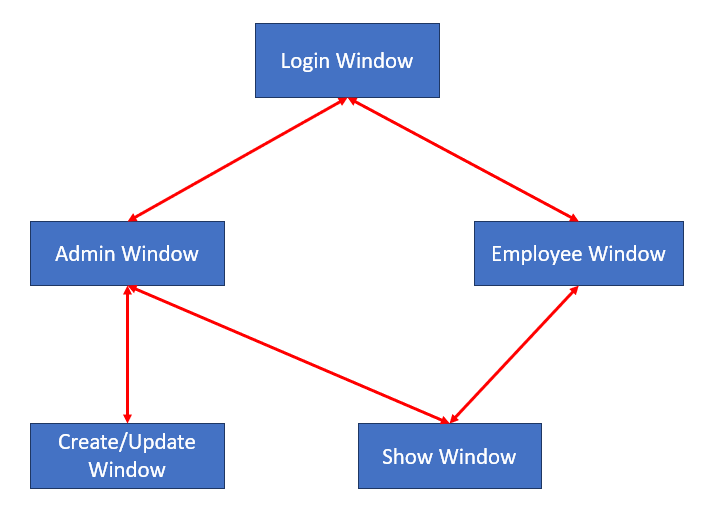
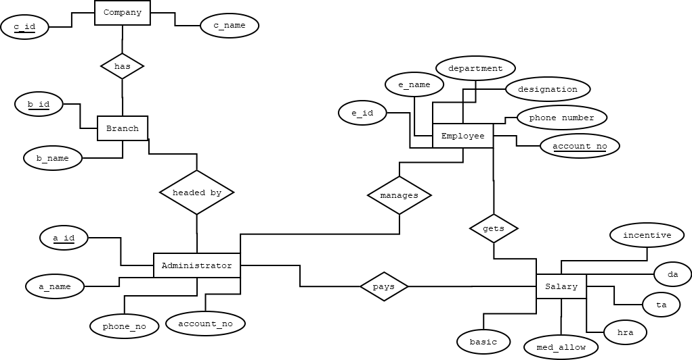

# Eazy Payroll
A Payroll Management System which works as a powerful and efficient tool in holding the financial records of employees.
This project collects data of each employee in a particular organization and efficiently uses a Database for storing, updating, deleting and retrieving the required data (CRUD Operations).

## Technology
The front-end GUI is built using TKinter module of Pyhton and for the back-end Database to store all the info, a Oracle RDBMS (Oracle Database 18c Express Edition) is used. 

## How to USE Eazy Payroll
1. Run the below command:
```
git clone https://github.com/therealsgopi/Eazy-Payroll.git
```
2. Edit your Oracle DB Username and Password in `Line 17` in the file `main.py`.
3. Start the program by executing "main.py" first!

## Screenshots
### Login Window:


### Employee Dashboard & Show Window:


### Default Close Button Disabled:


### Admin Dashboard:


### Admin Dashboard & Show Window:


### Employee Creation Wizard:


### Employee Updation Wizard:


## GUI Windows' Flow


## Modules' Flow


## Backend DB Schema Design - ER Diagram

